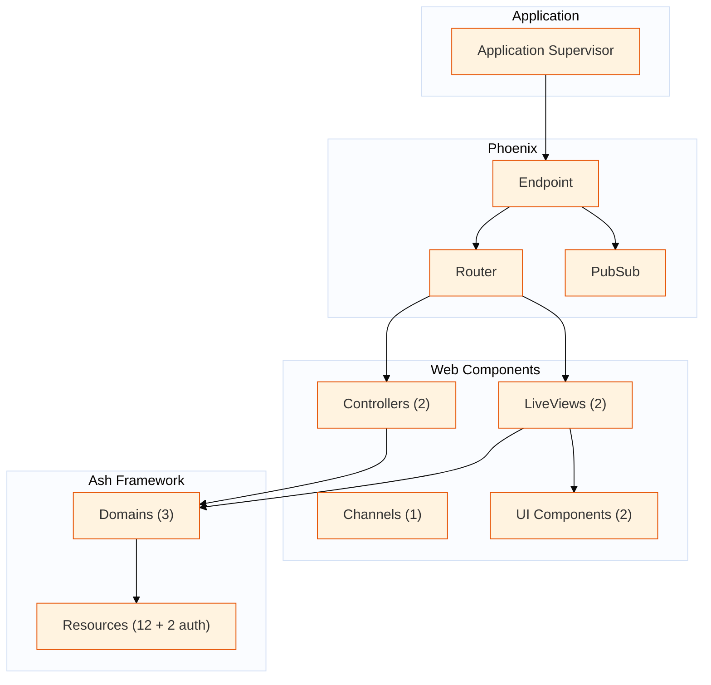

# Component Relationships

Generated: 2026-10-06

Project shape: single

This diagram shows the major components and their relationships.

## Component Counts

| Component | Count |
|-----------|-------|
| Controllers | 2 |
| LiveViews | 2 |
| Channels | 1 |
| UI Components | 2 |
| Ash Domains | 1 |
| Ash Resources | 2 |

## Manual Additions Needed

- [ ] GenServer processes
- [ ] Supervision tree details
- [ ] Background workers (Oban, etc.)
- [ ] External service clients
