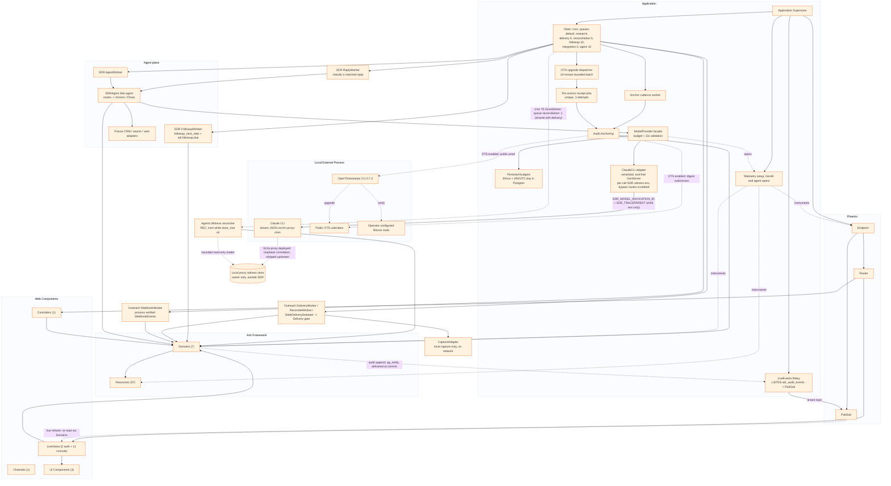

# Component Relationships

Generated: 2026-10-06

Project shape: single

This diagram shows the major components and their relationships.

## Component Counts

| Component | Count |
|-----------|-------|
| Controllers | 1 (auth) |
| LiveViews | 13 (2 AshAuthentication + 11 S10 console) |
| Channels | 1 |
| UI Components | 3 (core, layouts, console UI) |
| Ash Domains | 7 |
| Ash Resources | 57 |

## Manual Additions Needed

- [x] S6a budget process and serialized ClaudeCLI GenServer
- [x] S6a supervision tree detail
- [x] Audit anchor cadence and bounded, unique OTS upgrade jobs
- [x] Claude CLI local process boundary
- [x] S13 LiveEvents.Relay (commit-time audit notifications -> PubSub -> live console views, ADR-0012)
