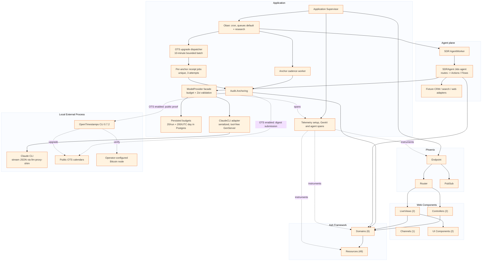

# Component Relationships

Generated: 2026-10-06

Project shape: single

This diagram shows the major components and their relationships.

## Component Counts

| Component | Count |
|-----------|-------|
| Controllers | 2 |
| LiveViews | 2 |
| Channels | 1 |
| UI Components | 2 |
| Ash Domains | 6 |
| Ash Resources | 49 |

## Manual Additions Needed

- [x] S6a budget process and serialized ClaudeCLI GenServer
- [x] S6a supervision tree detail
- [x] Audit anchor cadence and bounded, unique OTS upgrade jobs
- [x] Claude CLI local process boundary
