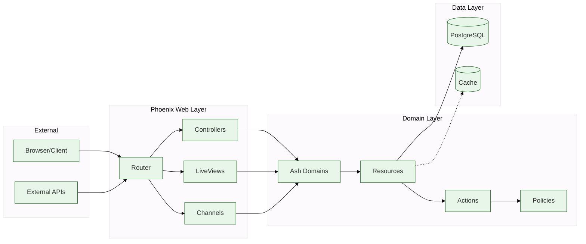

# Data Flow

Generated: 2026-10-06

Project shape: single

This diagram shows how data flows through the system, from external clients through Phoenix to domain modules.

## Flow Description

1. **External** - Browsers, mobile apps, API clients
2. **Web Layer** - Phoenix router, controllers, LiveViews, channels
3. **Domain Layer** - Ash domains orchestrate business logic
4. **Data Layer** - Persistence (PostgreSQL, ETS, etc.)

## Manual Additions Needed

- [ ] Specific external API integrations
- [ ] Message queues (if any)
- [ ] Background job processors
- [ ] PubSub flows for real-time updates
