# Domain Boundaries

Generated: 2026-10-06 (Sales and Research added by hand in S5, 2026-10-07)

Project shape: single

This diagram shows Ash domains and their resources, representing bounded contexts in the system.

```mermaid
%%{init: {'theme': 'base', 'themeVariables': { 'primaryColor': '#e1f5fe', 'primaryBorderColor': '#01579b'}}}%%
graph TB
    subgraph Research["Research Domain"]
        ResearchArtifact[ResearchArtifact]
        EvidenceClaim[EvidenceClaim]
        Qualification[Qualification]
        QualificationEvidence[QualificationEvidence]
    end
    subgraph Sales["Sales Domain"]
        IcpDefinition[IcpDefinition]
        Account[Account]
        Contact[Contact]
        Lead[Lead]
        Campaign[Campaign]
        Sequence[Sequence]
        SequenceStep[SequenceStep]
        CampaignEnrollment[CampaignEnrollment]
    end
    subgraph Agents["Agents Domain"]
        AgentDefinition[AgentDefinition]
        AgentRun[AgentRun]
        ModelInvocation[ModelInvocation]
        ToolInvocation[ToolInvocation]
        Decision[Decision]
    end
    subgraph Accounts["Accounts Domain"]
        User[User]
        Token[Token]
    end
    subgraph Audit["Audit Domain (lowest layer)"]
        Tenant[Tenant]
        AuditEvent[AuditEvent]
        AuditChainHead[AuditChainHead]
        ProvenanceSnapshot[ProvenanceSnapshot]
        Payload[Payload]
        AuditAccess[AuditAccess]
        RetentionMarker[RetentionMarker]
        AuditSigningKey[AuditSigningKey]
        AuditAnchor[AuditAnchor]
        AnchorSinkReceipt[AnchorSinkReceipt]
        AuditExport[AuditExport]
        Kernel{{Audit kernel<br/>append / verify / guard}}
    end

    AgentDefinition --> AgentRun
    AgentRun --> ModelInvocation
    AgentRun --> ToolInvocation
    AgentRun --> Decision
    ModelInvocation --> Decision
    ModelInvocation -. request/response sha256 FK .-> Payload
    ToolInvocation -. input/output sha256 FK .-> Payload
    Decision -. inputs sha256 FK .-> Payload
    Agents -. tenant_id FK .-> Tenant
    Agents == "AppendEvent change (same transaction)" ==> Kernel
    Kernel --> AuditChainHead
    Kernel --> AuditEvent
    Kernel --> AuditAccess
    AuditEvent --> ProvenanceSnapshot
    AuditEvent --> Tenant
    AuditChainHead --> Tenant
    AuditAnchor --> AuditSigningKey
    AuditAnchor --> AnchorSinkReceipt
    AuditExport -. anchor ids .-> AuditAnchor

    Account --> Contact
    Contact --> Lead
    Account --> Lead
    IcpDefinition --> Campaign
    Sequence --> SequenceStep
    Sequence --> Campaign
    Campaign --> CampaignEnrollment
    Lead --> CampaignEnrollment
    Lead -. last_decision_id FK .-> Decision
    Lead -. owner_user_id FK .-> User
    ResearchArtifact --> EvidenceClaim
    Qualification --> QualificationEvidence
    EvidenceClaim --> QualificationEvidence
    ResearchArtifact -. lead_id FK .-> Lead
    EvidenceClaim -. lead_id FK .-> Lead
    Qualification -. lead_id / icp FK .-> Lead
    Qualification -. qualify / disqualify in the same transaction .-> Lead
    ResearchArtifact -. run / tool invocation FK .-> ToolInvocation
    EvidenceClaim -. extraction decision FK .-> Decision
    Qualification -. decision / run FK .-> Decision
    ResearchArtifact -. content sha256 FK .-> Payload
    User -. tenant_id FK .-> Tenant
    Sales -. tenant_id FK .-> Tenant
    Research -. tenant_id FK .-> Tenant
    Accounts == "AppendEvent (user.*, auth.*)" ==> Kernel
    Sales == "AppendEvent (sales.*)" ==> Kernel
    Research == "AppendEvent (research.*)" ==> Kernel


    %% Project shape: single
    %% Layering (ADR-0009): Audit <- Accounts <- Operations <- Agents <- Sales <- Research <- Outreach
    %% Embedded resources (incl. IcpCriteria, SourceLocation, QualificationCriteria) are omitted.
```

## Notes

- Each box represents a domain (bounded context)
- Resources inside show entities managed by that domain
- Cross-domain references should use IDs, not direct associations

## Manual Additions Needed

- [ ] Cross-domain relationships (arrows between domains)
- [ ] External service boundaries
- [ ] Shared kernel modules (if any)
